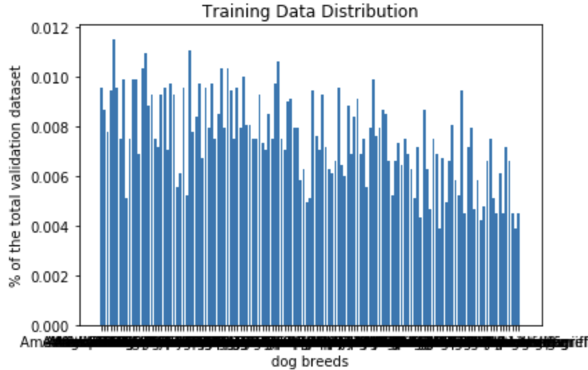
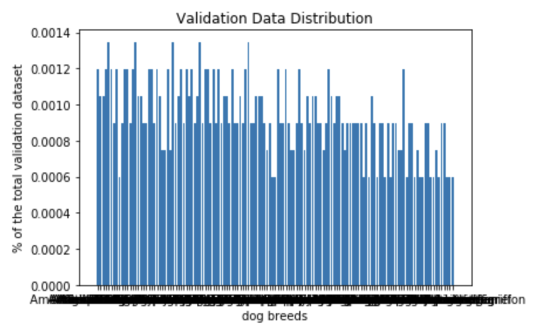
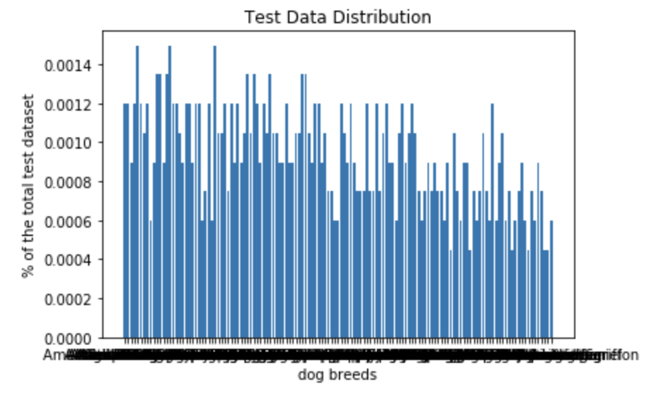
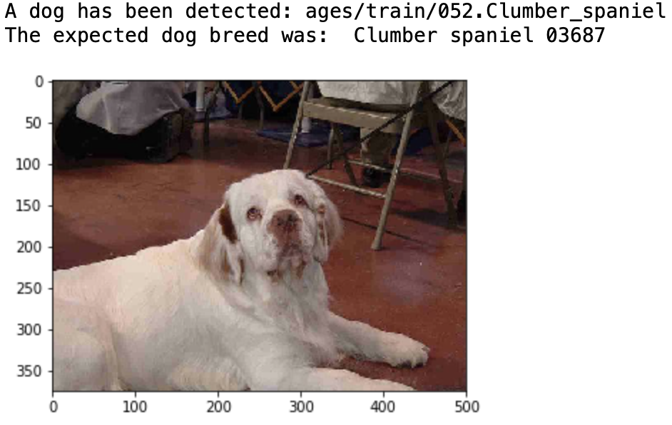
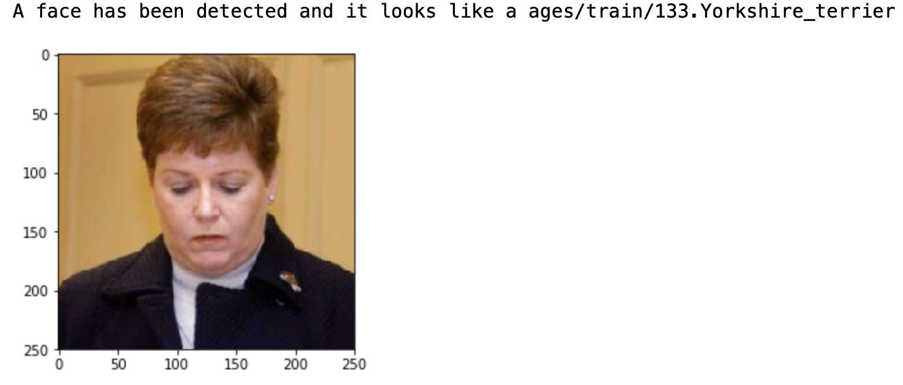

# Dog Breed Classifier
This project is part of Udacity’s Data Science capstone project. 

## Overview
The aim of the project was to create an image classifier for dog breeds by building a model from scrratch and by using transfer learning. The model can be integrated in a larger app that needs to detect the breed of a dog in an input image, e.g., proposing medical investigations for dogs according to their breed as some breeds are predisposed to specific medical conditions. It must be stated that the model does not predict multiple breeds for a dog, so a crossbreed dog will be predicted the closest breed in terms of physical characteristics. More about this project on my post on [medium](https://medium.com/@mlacra/detecting-a-dogs-breed-using-convolutional-neural-networks-3e737290acdd).

## The ipynb notebook is divided in the following steps:
    Step 0: Import Datasets
    Step 1: Detect Humans
    Step 2: Detect Dog
    Step 3: Create a CNN to Classify Dog Breeds (from Scratch)
    Step 4: Create a CNN to Classify Dog Breeds (using Transfer Learning)
    Step 5: Write the Algorithm
    Step 6: Test the Algorithm

## Data

This data set has 8,351 total images showing 133 different breeds. The distribution of the data is shown in the bellow images:

### Evaluation
Given that the data is slightly imbalanced and the problem is a for multiclassification, I used accuracy evaluation metric and categorical_crossentropy cost function. The log loss punishes the classifier if the prediction is different from the real one.

## Dog detector
The project uses the pretrained ResNet_50 weights in keras to detect dog from images. This detector proved to be accurate with a 100% true positives and 0% false positives rate tested on 100 sample dog images and 100 human images. If a dog is detected, then it proceeds into predicting the breed of the dog.

## Human detector
The project uses OpenCV’s implementation of Haar feature-based cascade object classifier to detect human faces in images. This detector proved to be slightly less accurate with a 100% true positives and 11% false positives rate tested on 100 sample human images and 100 dog images, respectively.  If a human face is detected, then it the app proceeds into showing the most resembling breed to the face in the image.

## Dog classifier 
### CNN Architecture
* _Convolutional Layers._ For building the network, I used Keras to create its architecture with three convolutional layers with Relu activation functions.
The three convolutional layers contain 16, 32, and 64 filters, respectively. With each layer, the image is squeezed by reducing its width and height while increasing the depth. The depth represents the number of filters the layer has. Each filter usually focuses on different patterns in an image, e.g., one filter might focus on detecting teeth, one on detecting ears etc. The more filters the CNNs have, the more details the model can learn about an image. However, adding too many filters could become computationally expensive.
* _Pooling._ After each convolutional layer, I added MaxPooling. The purpose of Pooling is to down-sample a representation, e.g., an input image or the output of a layer, reducing its dimensionality. Although, some of the accuracy might be lost through pooling, the advantage is that it significantly reduces the number of parameters, consequently reducing the computation on the network. Moreover, it helps the network not to overfit.
* _Dropout._ After the last convolutional layer, I added Dropout of 25%. Dropout is a regularization technique used in training neural networks so as to avoid overfitting the model. The effect of our added dropout of 25% means that, during training, the network will randomly deactivate a node with a probability of 0.25 and only the active nodes will be trained. 

## Files
extract_bottleneck_features.py - Contains functions to process the pretrained models.

haarcascades - contains the filters used for the human face detector.

_my files_ and _images_ - folders with images to test the model.

saved_models - contains the trained models

dog_breed_classifier.ipynb.ipynb - the jupyter notebook containing the whole code 

## Example of classifier outputs:

## Libraries 
    * opencv-python==3.2.0.6
    * keras==2.0.2
    * h5py==2.6.0
    * matplotlib==2.0.0
    * numpy==1.12.0
    * scipy==0.18.1
    * tqdm==4.11.2
    * scikit-learn==0.18.1
    * tensorflow==1.0.0